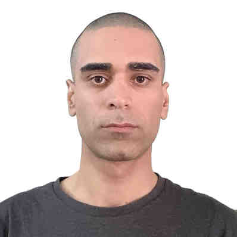

# Mahan Parham

**Mahmoud Parham**

maparham40 at gmail

**Senior Software Developer**

I received my PhD from the University of Vienna (2022, [thesis](https://utheses.univie.ac.at/detail/62431)).
I was honored to be a member of the research group [Communication Technologies](https://ct.cs.univie.ac.at/team/person/102452/) led by [Prof. Stefan Schmid](https://schmiste.github.io/).
My research involved solving optimization problems around software-defined networking and network function virtualization concepts.
I'm interested in applied research and/or development opportunities in English-speaking companies.

## Work and Education

- June 2025--Present. Chatlyn, Vienna
- 
- November 2023--May 2025. IMS Nanofabrication GmbH, Software Developer, Vienna

- September 2022--July 2023. Salzburg Research mbH, Research and Development
  
- May 2022–August 2022. Software Developer, Parity Quantum Computing GmbH, Innsbruck

- March 2018–December 2022. Doktoratsstudium der technischen Wissenschaften, University of Vienna, supervised by Prof. Stefan Schmid, Thesis: Algorithms for Traffic Control Challenges in Softwarized Networks 2, defended December 2022

- May 2017–February 2018. PhD Fellow in Computer Science, Aalborg University, Denmark, Supervisor: Stefan Schmid (continued in Austria)

- February 2014–October 2015. Software Developer, Doc Cirrus GmbH, Berlin, Germany

- 2010–2012. MSc in Computer Science, Sharif University, Tehran, Iran

- 2004–2009. BSc in Informatics, Kharazmi University, Tehran, Iran

## Publications

1. [Traffic Engineering with Joint Link Weight and Segment Optimization \
](https://schmiste.github.io/conext21te.pdf)Mahmoud Parham, Thomas Fenz, Nikolaus Süss, Klaus-Tycho Foerster, and Stefan Schmid.
17th ACM International Conference on emerging Networking EXperiments and Technologies (**CoNEXT**), Munich, Germany, December 2021.

2. [Optimal Online Balanced Graph Partitioning \
](https://schmiste.github.io/infocom21repartitioning.pdf)Maciej Pacut, Mahmoud Parham, and Stefan Schmid.
40th IEEE Conference on Computer Communications (**INFOCOM**), Virtual Conference, May 2021.

3. [Local Fast Segment Rerouting on Hypercubes \
](https://schmiste.github.io/opodis18.pdf)Klaus-Tycho Foerster, Mahmoud Parham, Stefan Schmid, and Tao Wen. \
22nd International Conference on Principles of Distributed Systems (**OPODIS**), Hong Kong, December 2018.

4. [TI-MFA: Keep Calm and Reroute Segments Fast \
](https://schmiste.github.io/gi18.pdf)Klaus-Tycho Foerster, Mahmoud Parham, Marco Chiesa, and Stefan Schmid. \
IEEE Global Internet Symposium (**GI**), Honolulu, Hawaii, USA, April 2018.

5. [A Walk in the Clouds: Routing through VNFs on Bidirected Networks \
](https://schmiste.github.io/algocloud17.pdf)Klaus-Tycho Foerster, Mahmoud Parham, and Stefan Schmid.
3rd International Workshop on Algorithmic Aspects of Cloud Computing (**ALGOCLOUD**), collocated with ESA, Vienna, Austria, September 2017.

[Complete List in Google Scholar](https://scholar.google.com/citations?user=6d54q7IAAAAJ&hl=en)

## Education

- March 2018-2022 PhD student (praedoc), University of Vienna, Supervisor: Stefan Schmid,
  - Thesis: [Algorithms for Traffic Control Challenges in Softwarized Networks](https://github.com/maparham/maparham.github.io/raw/main/PhD_thesis_MahmoudParham.pdf)
- May 2017-February 2018 PhD Fellow in Computer Science, Aalborg University,
Denmark, Supervisor: Stefan Schmid
- 2010-2012, Master of Science, Sharif University of Technology, Tehran, Iran
- 2004-2009, Bachelor in Computer Engineering, Kharazmi University, Tehran, Iran
- 2000-2004, High School Diploma in Mathematics and Physics, Shahrood, Iran

## Some More

- I started with programming out of passion in high school and got first commercial job in 2004 during bachelor studies in Tehran.
- Had my first working experience abroad in a Berlin startup 2013, [Doc Cirrus GmbH](https://www.doc-cirrus.com) (2013--2015) as a backend developer.
- During the Berlin life, I was fancying doing a PhD in CS and finally did it in 2022 in Wien.
- I'm familiar with modern C++, Java, Javascript, Python, Bash,...
- I'd like to be involved in challenging problem solving activies that keep me away from the mundanes of daily life. I'm pretty much flexible in picking up new technologies and scientific fields as work demands.
